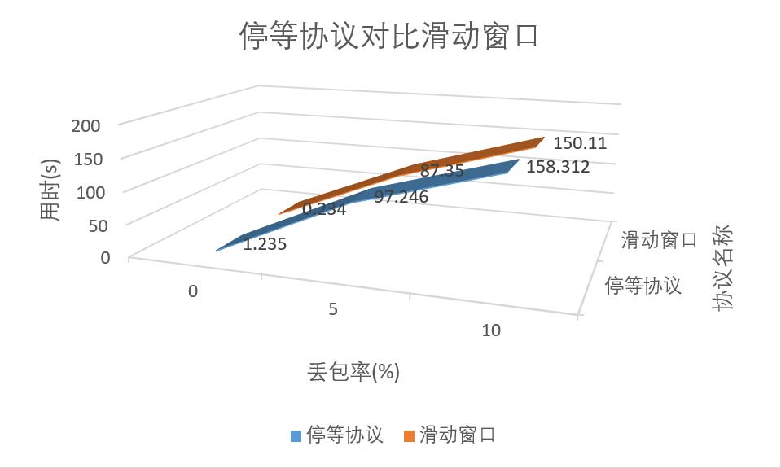
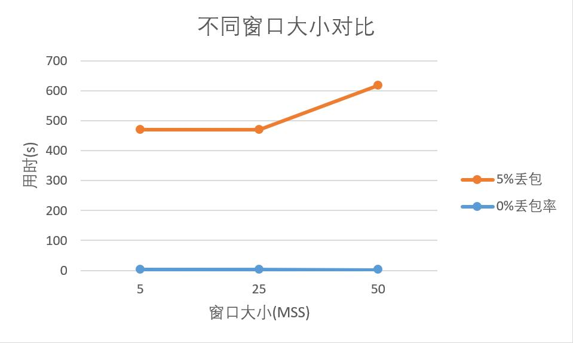
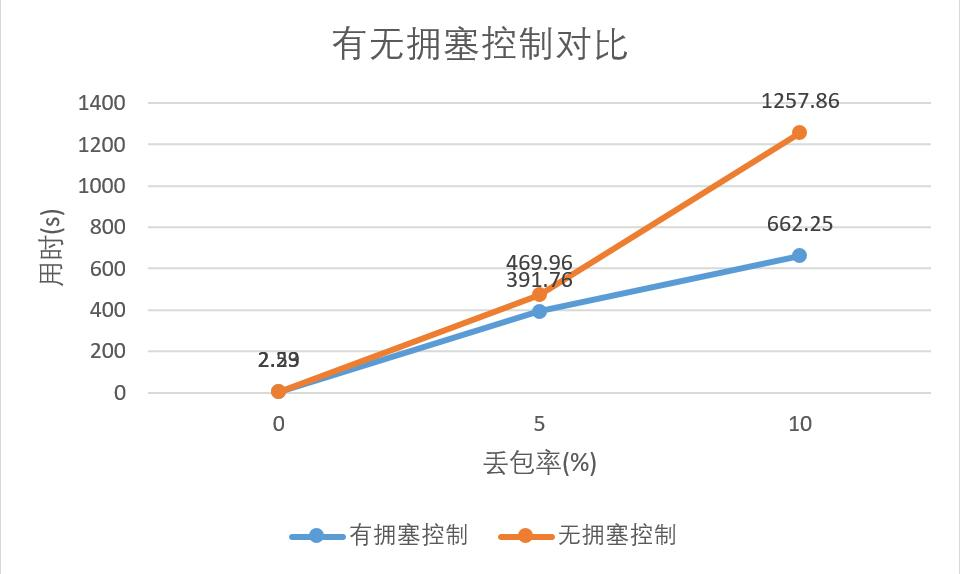

## 计算机网络 3-4对比实验

#### 停等协议与滑动窗口对比
运行环境均为使用router传送1M数据使用的时间，时间越短越好，计时单位为秒，mss为510，窗口大小为25，timeout为500ms

| 配置| 停等协议|滑动窗口|
|---|---|----|
|   丢包率 0%|  1.235s |  0.234s|
|   丢包率 5%|   97.246s | 87.35s  |
|   丢包率 10%|   158.312s |  150.11s   |

分析：当传输的丢包率增加时，各个协议因为需要停等超时触发的超时重传十分耽误时间，因此传输用时普遍增加。

因为滑动窗口可以更高效利用发送的带宽，提高带宽利用率，因为相较于停等协议有部分提升，但是由于丢包问题，GBN协议要求的回退N完全的重传也导致时间延长很大，因此较停等协议更优但是差别不大。

#### 滑动窗口不同的窗口大小的传输时间

运行环境均为使用router传送1M数据使用的时间，时间越短越好，计时单位为秒，丢包率5%，mss为250，timeout为1500ms
| 窗口大小| 传输时间|
|---|---|
|   5|  469.96s |     
|   25|   470.33s |      
|   50|   619.30s |     

运行环境均为使用router传送1M数据使用的时间，时间越短越好，计时单位为秒，丢包率0%，mss为250，timeout为1500ms
| 窗口大小| 传输时间|
|---|---|
|   5|  2.53s |     
|   25|   2.52s |      
|   100|   2.29s |     

分析：滑动窗口协议因为其每次发送都会发送窗口大小的数据段，因此在丢包率较小的时候，越大的窗口总的来说是越优的，因为丢包率较小，传输时间差异不大，但是总体来说还是可以看出其更优。

当丢包率较大是，因为窗口的大小增加会导致GBN的时候重传的数据包过多，因此窗口太大会导致时间过长。

因此我们需要根据丢包率队窗口大小做一个折中。

#### 滑动窗口不同的窗口大小的传输时间

运行环境均为使用router传送1M数据使用的时间，时间越短越好，计时单位为秒，mss为250，timeout为1500ms，无拥塞控制协议窗口大小为25
| 丢包率| 有拥塞控制|无拥塞控制|
|---|---|--|
|   0%|  2.29s |2.53s  | 
|   5%| 391.76s  |  469.96s |  
|   10%|   662.25s |  1257.86s  | 

分析：拥塞控制就是一个在丢包率和窗口大小上的一个动态调整，因为其可以在没有丢包时尽量的扩大自己窗口提高带宽利用率；在丢包率提高是，减小窗口，防止GBN重传过多，因此，其在大部分情况下优于无拥塞控制的方案。